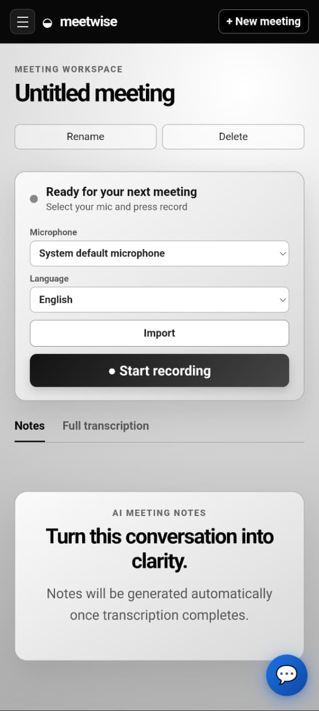
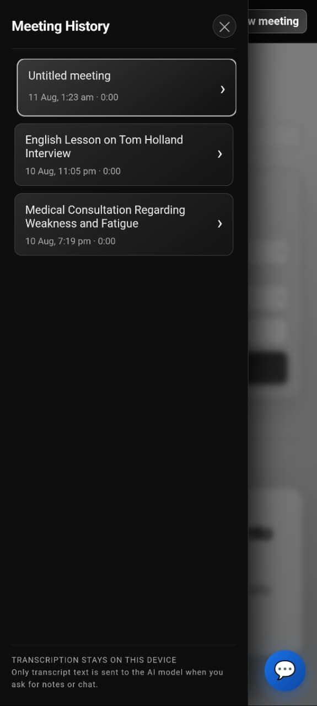
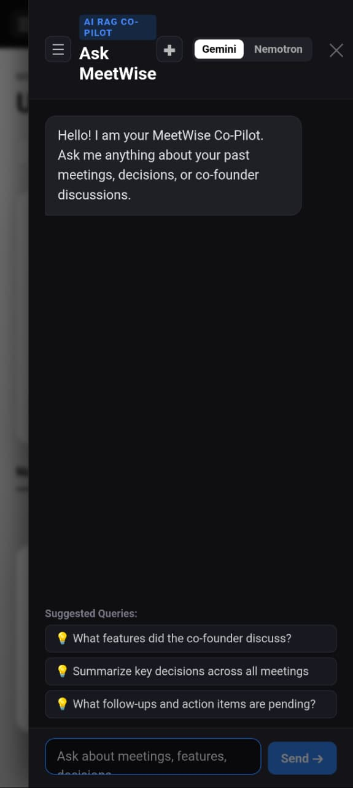
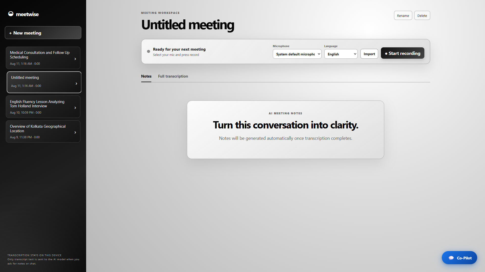
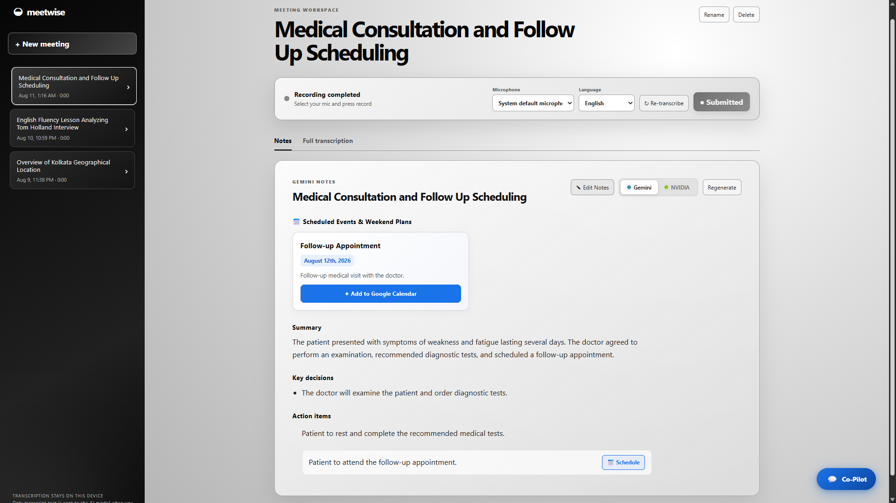
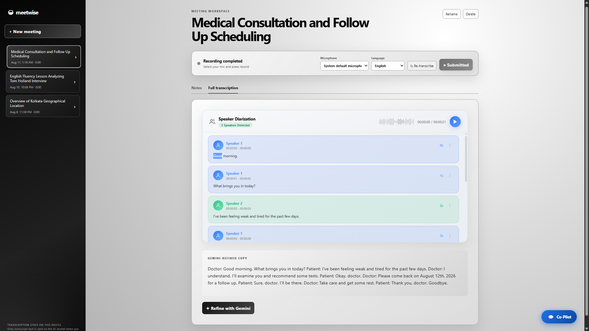
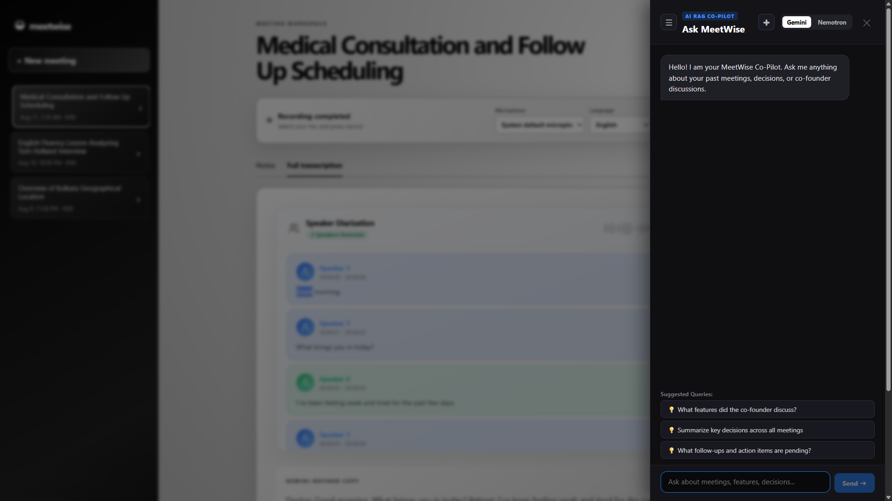
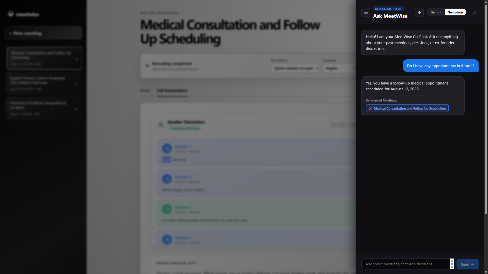
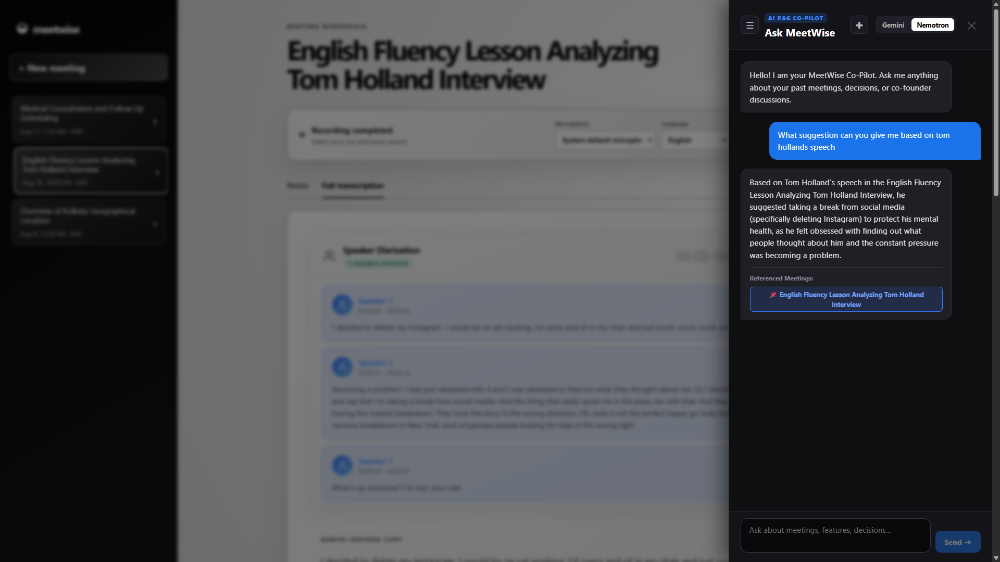

# MeetWise: Privacy-First In-Browser AI Meeting Co-Pilot

[](https://meetwise-ba0b.onrender.com/)
[](APK/app-release.apk)
[](APK/app-debug.apk)
[](LICENSE)

> 🌐 **LIVE APPLICATION**: Experience MeetWise live in your browser:  
> 👉 [**https://meetwise-ba0b.onrender.com/**](https://meetwise-ba0b.onrender.com/) 👈  
>  
> 📱 **ANDROID APKS**: Download the native Android application builds directly:  
> 📦 [**Download Release APK (`app-release.apk`)**](APK/app-release.apk) | 🐛 [**Download Debug APK (`app-debug.apk`)**](APK/app-debug.apk)

---

MeetWise is an open-source, privacy-focused AI meeting intelligence platform that delivers real-time Automatic Speech Recognition (ASR), multi-speaker diarization, structured meeting summary generation, and Retrieval-Augmented Generation (RAG) meeting chat directly within the web browser.

Audio processing and transcription take place locally using ONNX Runtime Web and WebGPU/WASM execution backends via `@huggingface/transformers`. Only plain-text transcripts are transmitted to LLM API endpoints for summarization and contextual query answering.

---

## 🌐 Live Application & Mobile Downloads

The application is deployed live on Render and available as pre-built Android APKs:

| Platform / Artifact | Link / Download | Description |
| :--- | :--- | :--- |
| **MeetWise Live Web App** | [**https://meetwise-ba0b.onrender.com/**](https://meetwise-ba0b.onrender.com/) | 🟢 **Live Web Application** |
| **Android App (Release)** | [**APK/app-release.apk**](APK/app-release.apk) | 📦 **Production Release Build (43.6 MB)** |
| **Android App (Debug)** | [**APK/app-debug.apk**](APK/app-debug.apk) | 🐛 **Developer Debug Build (66.2 MB)** |

---

## 📸 Screenshots & Feature Walkthrough

MeetWise is built with a responsive design tailored for both mobile devices and desktop screens.

### 📱 Mobile Experience

| Mobile Meeting Workspace | Meeting History Drawer | Mobile RAG Co-Pilot |
| :---: | :---: | :---: |
|  |  |  |

---

### 💻 Desktop Experience & Features

#### 1. Main Meeting Workspace & Audio Input Controls
Select your microphone input or drag-and-drop audio/video files with automatic language detection or explicit multi-language selection.


#### 2. Structured AI Notes & Google Calendar Integration
Automatically generates meeting overview, key decisions, action items, and 1-click Google Calendar scheduling links for detected follow-up appointments.


#### 3. In-Browser Speaker Diarization & Audio Waveform Player
Segments speaker turns (Speaker 1, Speaker 2) with timestamped chunks, interactive audio playback waveform, and Gemini-refined transcripts.


#### 4. AI RAG Co-Pilot & Cross-Meeting Intelligence
Ask natural language questions across recorded meetings using local Retrieval-Augmented Generation with direct context citations.

| Co-Pilot Drawer Interface | Dual Model Switching (Gemini & NVIDIA Nemotron) |
| :---: | :---: |
|  |  |

| Context-Aware Meeting Q&A | Multi-Meeting Retrieval & Citations |
| :---: | :---: |
|  |  |

---

## Architectural Highlights

- **Local WebGPU/WASM Inference**: Transcribes audio and segments speaker turns directly on-device using a dedicated Web Worker pipeline, eliminating audio streaming to third-party servers.
- **Multilingual Automatic Speech Recognition**: Powered by `onnx-community/whisper-base_timestamped` with native automatic language detection and explicit `transcribe` task binding to preserve non-English scripts (including Hindi, German, Marathi, Bengali, Tamil, Telugu, etc.).
- **Speaker Diarization**: Integrates `onnx-community/pyannote-segmentation-3.0` for frame-level audio classification and speaker turn assignment.
- **Dual LLM Summarization Architecture**: Leverages Google Gemini 3.6 Flash as the primary JSON-structured summary provider, backed by an automatic quota recovery mechanism to NVIDIA Nemotron 3 Nano Omni (via NVIDIA NIM).
- **RAG-Powered AI Co-Pilot**: Features a client-side Retrieval-Augmented Generation engine (`src/utils/rag.js`) that indexes meeting titles, summaries, action items, and transcripts for grounded cross-meeting Q&A.
- **Automated Calendar Integration**: Natural Language Processing (NLP) date-time extractor (`src/utils/calendar.js`) supporting relative expressions, full days of the week (Sunday through Saturday), and 1-click Google Calendar URL generation.

---

## System Architecture

```
                                  BROWSER CLIENT (Local On-Device)
+-----------------------------------------------------------------------------------------------+
|                                                                                               |
|  Microphone / File Input ---> AudioContext (16kHz Resampling) ---> Web Worker Thread          |
|                                                                           |                   |
|                                                                 +---------+---------+         |
|                                                                 |                   |         |
|                                                          Whisper ONNX        Pyannote 3.0     |
|                                                          ASR Model           Diarization      |
|                                                         (WebGPU/WASM)         (WASM)          |
|                                                                 |                   |         |
|                                                                 +---------+---------+         |
|                                                                           |                   |
|                                                                 Timestamped Transcript &      |
|                                                                 Speaker Turn Segments         |
+---------------------------------------------------------------------------|-------------------+
                                                                            |
                                                                    (Plain-Text Only)
                                                                            |
                                  SERVER ENDPOINTS (API Layer)              v
+-----------------------------------------------------------------------------------------------+
|                                                                                               |
|      POST /api/summarize  --------> Google Gemini 3.6 Flash (Structured JSON Schema)          |
|                                                                                               |
|      POST /api/summarize/nvidia -> NVIDIA Nemotron-3-Nano-Omni (Quota Exceeded Fallback)     |
|                                                                                               |
|      POST /api/chat & /nvidia ----> RAG-Augmented Contextual Meeting QA                       |
|                                                                                               |
+-----------------------------------------------------------------------------------------------+
```

---

## Core Technical Components

### 1. In-Browser ASR & Diarization (`src/worker.js`)
The transcription pipeline executes off the main thread inside a Dedicated Web Worker:
- **ASR Engine**: `whisper-base_timestamped` in quantized ONNX format (`q4`/`fp32` on WebGPU, `q8` on WASM).
- **Speaker Segmentation Engine**: `pyannote-segmentation-3.0` processing Float32 pcm frames at 16,000 Hz.
- **Language Detection & Preservation**: Explicitly configured with `task: 'transcribe'` to prevent forced translation of foreign speech (such as Hindi or German) into English text.

### 2. LLM Summarization Service (`server/gemini.js` & `server/nvidia.js`)
Processes transcription payloads into structured JSON containing:
- **Title**: Specific 3 to 8 word title.
- **Overview**: Concise meeting overview.
- **Key Decisions**: Array of agreed decisions.
- **Action Items**: Executable task assignments with inline date detection.
- **Scheduled Events & Plans**: Event objects containing title, description, date/day, and time.
- **Open Questions**: Outstanding questions raised during the meeting.
- **Refined Transcript**: Plain-text transcript cleaned of filler words.

Language Preservation Rule: LLM prompts explicitly enforce language matching, requiring summaries and refined copies to output in the same script and language as the source meeting transcript.

### 3. Local RAG Retrieval Engine (`src/utils/rag.js`)
When querying the AI Co-Pilot drawer:
1. Historical meeting data (titles, summaries, action items, transcripts) is processed into normalized token vectors.
2. Query tokens are scored using a weighted algorithm prioritizing title exact matches, date relevance, and term frequency.
3. Top relevant meeting contexts are injected into the Gemini or NVIDIA Nemotron chat prompt.

### 4. Date & Calendar Parsing Engine (`src/utils/calendar.js`)
- Parses relative terms (`today`, `tomorrow`, `day after tomorrow`, `this weekend`, `next week`) and explicit date formats (`August 15th`, `15/08/2026`).
- Supports day-of-week offset calculation for all 7 days (`Sunday` through `Saturday`).
- Generates direct Google Calendar template URLs (`https://calendar.google.com/calendar/render?action=TEMPLATE&...`).

---

## Directory Structure

```
MeetWise/
├── APK/                          # Android application APK packages
│   ├── app-release.apk           # Production Android release build
│   └── app-debug.apk             # Developer Android debug build
├── dist/                         # Compiled production bundle output
├── server/
│   ├── index.js                  # Production static server & API router
│   ├── gemini.js                 # Google Gemini API integration & schema validation
│   └── nvidia.js                 # NVIDIA NIM Nemotron/Gemma API integration
├── src/
│   ├── components/
│   │   ├── CalendarEventModal.jsx # 1-click Google Calendar scheduling modal
│   │   ├── ChatDrawer.jsx         # RAG Co-Pilot interactive chat interface
│   │   ├── LanguageSelector.jsx   # Prioritized multi-language selector dropdown
│   │   ├── MediaInput.jsx         # Media file drag-and-drop decoder
│   │   ├── Progress.jsx           # ONNX model download & WebGPU shader warmup progress
│   │   └── Transcript.jsx         # Speaker-labeled transcript viewer & exporter
│   ├── utils/
│   │   ├── calendar.js            # Date extraction & Google Calendar URL builder
│   │   └── rag.js                 # Text tokenization & meeting retrieval ranker
│   ├── App.jsx                    # Main application state, console controls, notes UI
│   ├── index.css                  # Vanilla CSS design system & dynamic layout styles
│   ├── main.jsx                   # React root entry point
│   └── worker.js                  # Web Worker running Whisper & Pyannote ONNX models
├── index.html                     # HTML5 application shell
├── package.json                   # Project dependencies and script declarations
├── vite.config.js                 # Vite development server configuration & middleware
└── .env.example                   # Environment variable template
```

---

## Prerequisites & Installation

### Requirements
- Node.js 18.0.0 or higher
- npm 9.0.0 or higher
- WebGPU-compatible modern browser (Google Chrome 113+, Microsoft Edge 113+, or Safari 18+) with WASM fallback support

### Installation Setup

1. Clone the repository:
```bash
git clone https://github.com/BadassAman4014/MeetWise.git
cd MeetWise
```

2. Install dependencies:
```bash
npm install
```

3. Create environment configuration:
Copy `.env.example` to `.env` in the project root:
```bash
cp .env.example .env
```

4. Configure API Keys in `.env`:
```env
GEMINI_API_KEY=your_gemini_api_key_here
NVIDIA_API_KEY=your_nvidia_nim_api_key_here
PORT=4173
```

---

## Running the Application

### Development Mode
Runs Vite development server with API middleware proxying `/api/*` endpoints:
```bash
npm run dev
```
Open `http://localhost:5173` in your browser.

### Production Build & Local Server
1. Build the frontend production assets:
```bash
npm run build
```

2. Start the Node.js production server:
```bash
npm start
```
The application will be accessible at `http://localhost:4173`.

---

## Usage Workflow

1. **Start Recording or Import**:
   - Select microphone device and language (default is `Auto Detect`).
   - Click **Start recording** or **Import** an existing audio/video file.
2. **Transcription & Diarization**:
   - The Web Worker loads ONNX models locally and streams transcription with speaker labels.
3. **Automated Notes**:
   - Notes are automatically generated via Gemini 3.6 Flash.
   - If Gemini rate limits occur, click **Retry with NVIDIA Nemotron** to complete generation.
4. **Re-Transcription**:
   - To re-transcribe a meeting in another language (e.g. Hindi, German, English), update the Language Selector and click **Re-transcribe**.
5. **Google Calendar Integration**:
   - Click **Schedule** on action items or **Add to Google Calendar** on scheduled events to launch Google Calendar with pre-populated event details.
6. **Co-Pilot RAG Chat**:
   - Open the **Co-Pilot** drawer to ask questions across all recorded meetings.

---

## License

This project is open source and available under the [MIT License](LICENSE).
